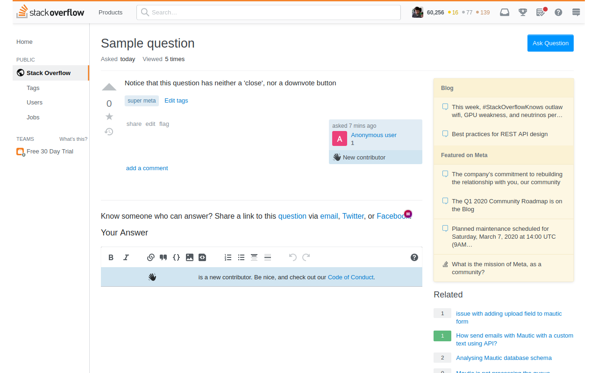

Stackoverflow Detoxifier
=======================

Removes some of the most toxic parts of Stack-Overflow, such as the downvote
and close buttons Do you have enough karma for these tools and a trigger
finger? This might help you prevent closing a question and making the community
a little worse. 

It's all too easy to read a question and quickly jump to the conclusion that
it's a bad question, or similar enough to another question that it's worth
closing.

However, you might not have time to read the entire question and might be
wrong. In those cases it's better to not close or downvote the question and
leave it to another community member to take the time to make an assessment.

Or perhaps the question was bad. Even in those cases, there might be community
members out there that are willing to take the time helping the poster by
leaving a thoughtful comment.

This add-on works by simply removing the negative aspects of stack overlow,
while keeping the truly important moderation tool intact (the report button,
used for problems such as spam or abuse).

This is add-on is especially recommended for site moderators, who can close
questions with just their own vote, instead of the usual threshold of 3.
